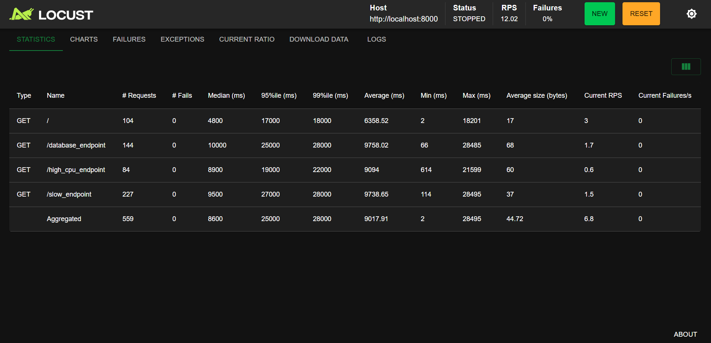
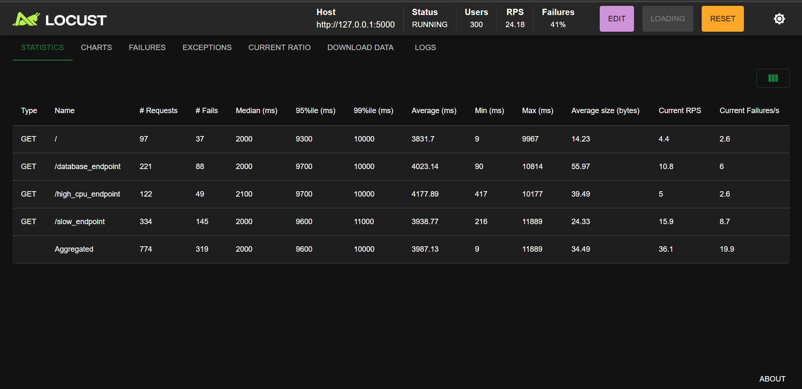
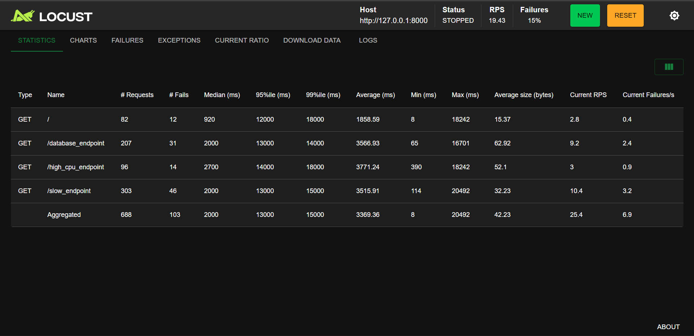

# Нагрузочное тестирование приложений

Проект содержит три идентичных веб-приложения на разных фреймворках для сравнения производительности под нагрузкой.

## Приложения

1. **FastAPI** (`app.py`): Асинхронный фреймворк.
2. **Flask** (`flask_app.py`): Синхронный фреймворк.
3. **aiohttp** (`aiohttp_app.py`): Асинхронный фреймворк.

Все приложения имеют одинаковые эндпоинты:
- `/`: Приветствие
- `/slow_endpoint`: Имитация медленной I/O-задачи (задержка 0.1 сек)
- `/high_cpu_endpoint`: Имитация CPU-нагрузки (вычисление суммы)
- `/database_endpoint`: Имитация запроса к БД (задержка 0.05 сек)

## Запуск приложений

### FastAPI
```bash
uvicorn app:app --reload --host 127.0.0.1 --port 8000
```

### Flask
```bash
python flask_app.py
# Запускается на http://127.0.0.1:5000
```

### aiohttp
```bash
python aiohttp_app.py
# Запускается на http://127.0.0.1:8000
```

## Нагрузочное тестирование

Используйте Locust (`locustfile.py`).

### Запуск тестов
1. Запустите одно из приложений.
2. В новом терминале:
```bash
locust -f locustfile.py --host http://127.0.0.1:8000  # Для FastAPI/aiohttp
# или
locust -f locustfile.py --host http://127.0.0.1:5000  # Для Flask
```
3. Откройте http://127.0.0.1:8089 в браузере для управления тестами.

### Сравнение результатов
- Запустите тесты для каждого приложения отдельно.
- Сравните RPS (запросов в секунду), latency, ошибки.
- FastAPI и aiohttp должны показывать лучшую производительность для I/O-задач благодаря асинхронности.

### Отчет по тестам
- **FastAPI** (`app.py`): стабильный результат, 0% ошибок, но низкий агрегированный RPS (~6.8) и высокая задержка (среднее около 9 с). Это говорит о том, что тестовая нагрузка сильно нагружает обработку запросов, и асинхронность компенсирует только часть проблемы.
- **Flask** (`flask_app.py`): самый высокий суммарный RPS (~36), но очень высокий процент отказов (41%). Сервер выдерживает большой поток, но теряет стабильность и начинает возвращать ошибки при нагрузке.
- **aiohttp** (`aiohttp_app.py`): лучший баланс между пропускной способностью и надежностью. Агрегированный RPS около 25, при этом уровень ошибок ниже, чем у Flask (примерно 15%), и средняя задержка ниже, чем у FastAPI.

### Выводы
- Flask показывает лучший пик пропускной способности, но оставляет желать лучшего по устойчивости при высокой нагрузке.
- FastAPI работает стабильнее, но у него меньшая производительность при текущей нагрузке из-за тяжелых операций.
- aiohttp демонстрирует наиболее сбалансированный результат: выше RPS, чем FastAPI, но меньше ошибок, чем Flask.



