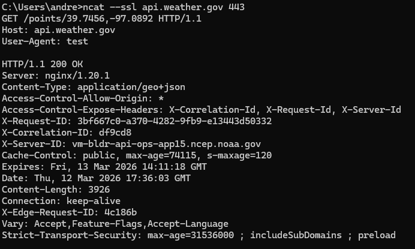
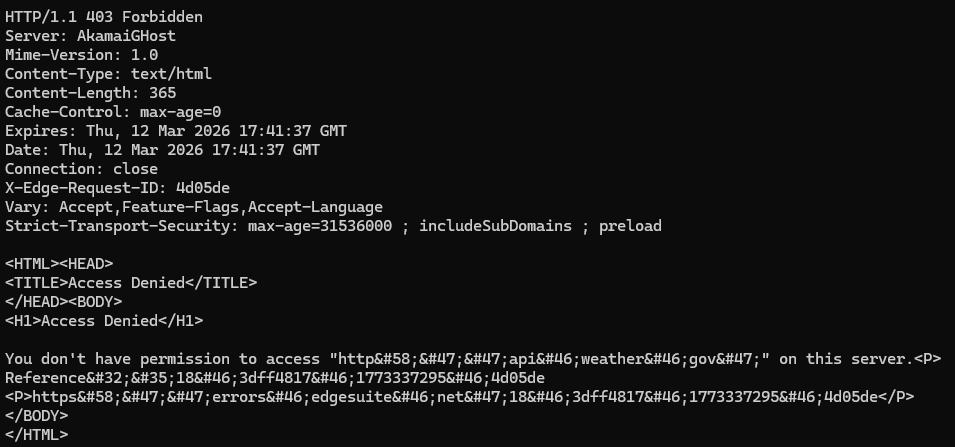
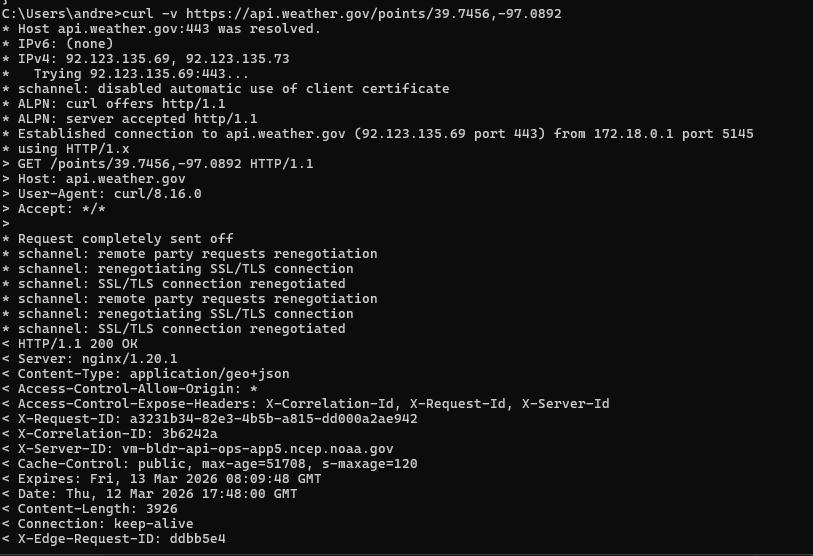
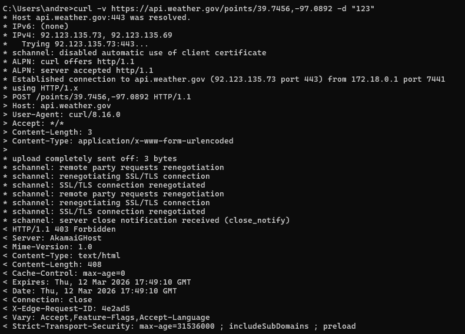
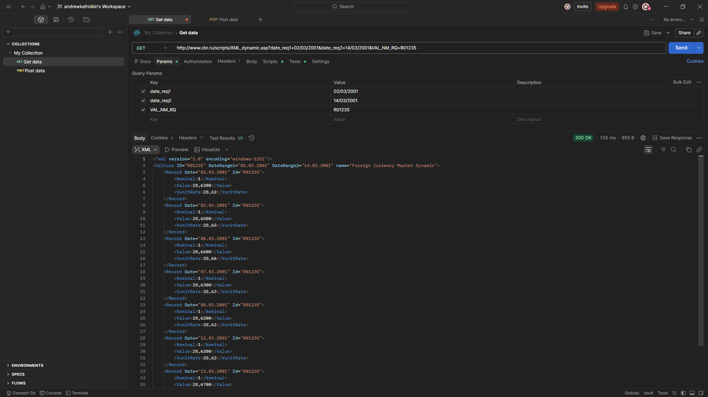
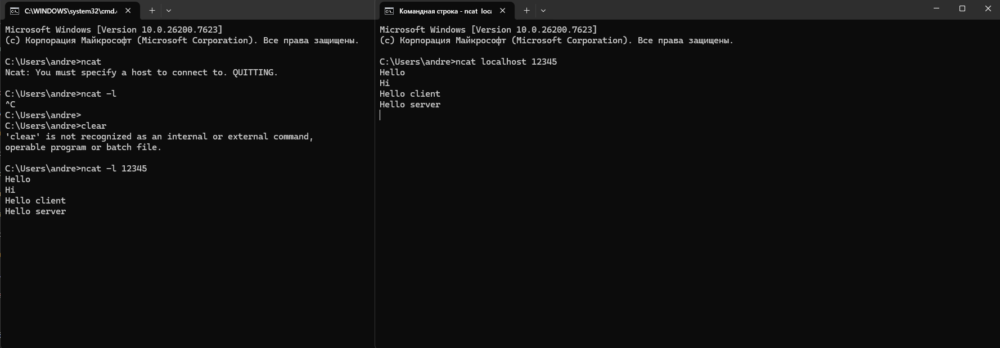

# Отправка запросов

api - api.weather.gov

## Netcat

команда - ncat --ssl api.weather.gov 443

### GET

Запрос:
```
GET /points/39.7456,-97.0892 HTTP/1.1
Host: api.weather.gov
User-Agent: test
```

Ответ сервера:

И еще много информации


### POST

Запрос:
```
POST / HTTP/1.1
Host: api.weather.gov
User-Agent: test
Content-Length: 0
```
Ответ сервера:


## Curl

### GET

```
curl -v https://api.weather.gov/points/39.7456,-97.0892
```



### POST

```
curl -v https://api.weather.gov/points/39.7456,-97.0892 -d "123"
```



## Postman + API Центробанк



## Чат

