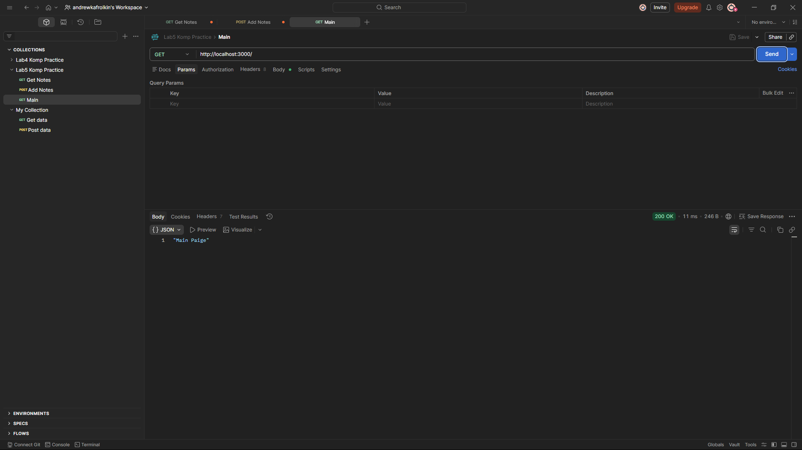
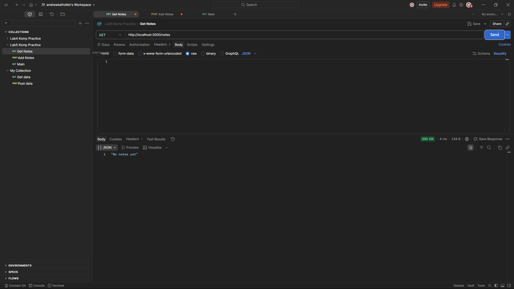
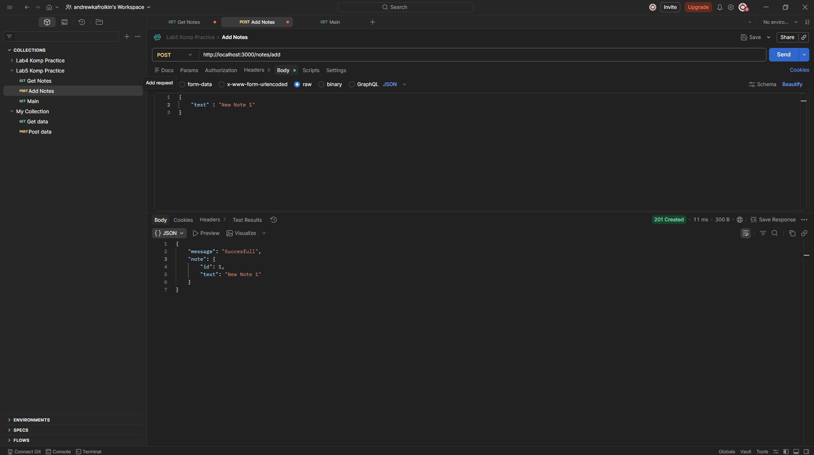
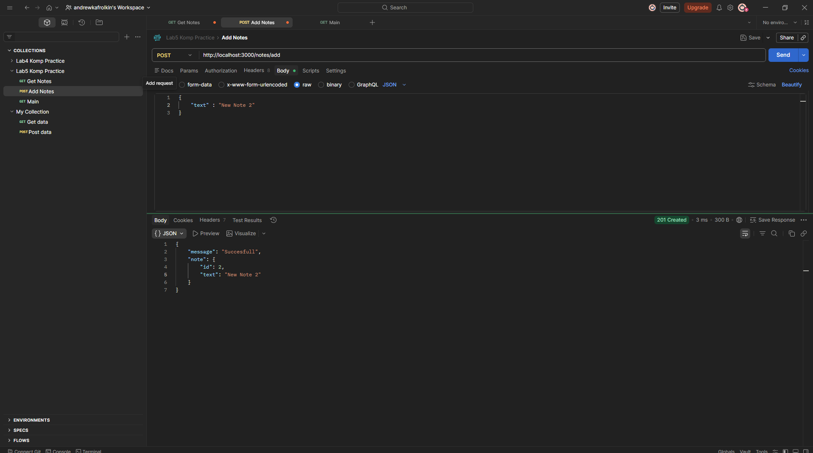
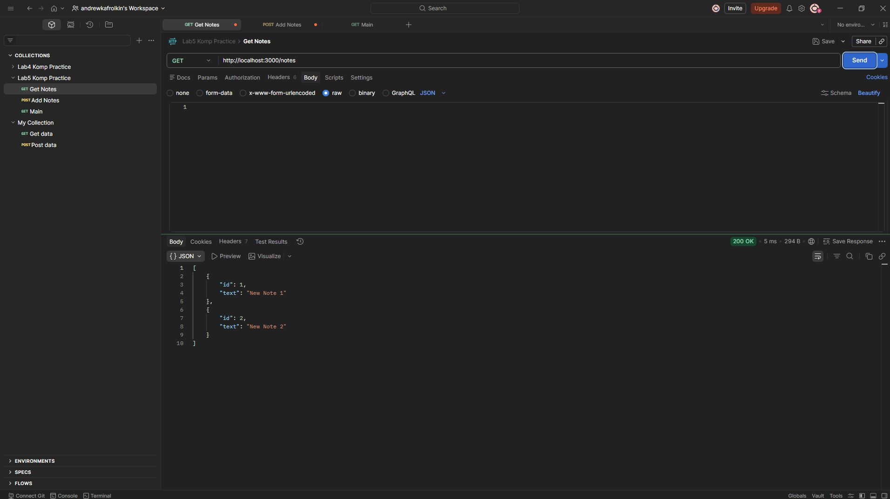
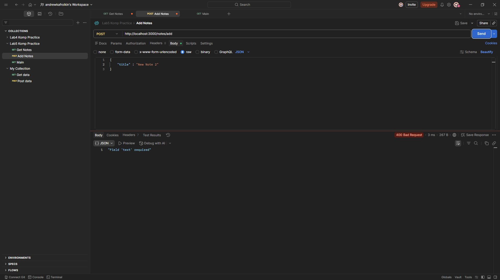

# Отчет по Лабораторной Работе №5
## Веб-приложение с поддержкой GET и POST запросов

---

## 1. Описание инструментария

### Используемые технологии:

| Компонент | Описание | Версия |
|-----------|---------|--------|
| **Node.js** | JavaScript runtime для серверной части | LTS |
| **Express.js** | Минималистичный веб-фреймворк для Node.js | 5.2.1 |
| **Язык программирования** | JavaScript (ES6+) | - |
| **Инструменты тестирования** | Postman, cURL, браузер | - |

### Причина выбора:
- **Express.js** – легкий и быстрый фреймворк для создания REST API
- **Node.js** – выполняет роль серверной части, позволяет использовать JavaScript
- Быстрая разработка без лишних накладных расходов
- Обширная документация и большое сообщество

### Установка зависимостей:
```bash
npm install express
```

---

## 2. Структура проекта

```
Lab5/
├── app.js           # Основной файл приложения
├── package.json     # Конфигурация и зависимости
└── Readme.md        # Этот отчет
```

---

## 3. Полный исходный код приложения

### Файл: `app.js`

```javascript
const express = require('express')

const PORT = 3000
const app = express()

let notes = [];

app.use(express.json())

app.get("/", (req, res) => {
    res.status(200).json("Main Paige")
})

app.get("/notes", (req, res) => {
    if (notes.length == 0){
        res.status(200).json("No notes yet")
    } else { 
        res.status(200).json(notes)
    }
})

app.post("/notes/add", (req, res) => {
    try{
        const { text } = req.body

        if(!text){
            res.status(400).json("Field 'text' required")
        }

        const note = {
            id: notes.length + 1,
            text: text
        }

        notes.push(note)

        res.status(201).json({message: "Succesfull", note: note})
    } catch (err) {
        res.status(500).json({message: "Internal Server Error"})
    }
})

app.listen(PORT, () => {
    console.log(`Server is running on http://localhost:${PORT}`)
})
```

### Файл: `package.json`

```json
{
  "name": "lab5",
  "version": "1.0.0",
  "description": "",
  "main": "index.js",
  "scripts": {
    "test": "echo \"Error: no test specified\" && exit 1"
  },
  "keywords": [],
  "author": "",
  "license": "ISC",
  "type": "commonjs",
  "dependencies": {
    "express": "^5.2.1"
  }
}
```

---

## 4. Описание API

### Эндпоинты приложения:

#### 1. GET `/` – Главная страница
**Описание**: Возвращает сообщение с главной страницы

**Параметры**: Нет

**Ответ (200 OK)**:
```json
"Main Paige"
```

---

#### 2. GET `/notes` – Получить все заметки
**Описание**: Возвращает список всех сохраненных заметок

**Параметры**: Нет

**Ответ (200 OK) – когда нет заметок**:
```json
"No notes yet"
```

**Ответ (200 OK) – когда есть заметки**:
```json
[
  {
    "id": 1,
    "text": "Первая заметка"
  },
  {
    "id": 2,
    "text": "Вторая заметка"
  }
]
```

---

#### 3. POST `/notes/add` – Добавить заметку
**Описание**: Добавляет новую заметку в хранилище в памяти

**Content-Type**: `application/json`

**Тело запроса**:
```json
{
  "text": "Текст заметки"
}
```

**Ответ (201 Created)**:
```json
{
  "message": "Succesfull",
  "note": {
    "id": 1,
    "text": "Текст заметки"
  }
}
```

**Ответ (400 Bad Request) – при отсутствии поля `text`**:
```json
"Field 'text' required"
```

**Ответ (500 Internal Server Error)**:
```json
{
  "message": "Internal Server Error"
}
```

---

## 5. Инструкция по запуску

### Шаг 1: Установка зависимостей
```bash
npm install
```

### Шаг 2: Запуск сервера
```bash
node app.js
```

**Ожидаемый вывод в консоли**:
```
Server is running on http://localhost:3000
```

### Шаг 3: Проверка работы
Открыть в браузере: `http://localhost:3000/`

---

## 6. Демонстрация работы через Postman

### Скриншот 1: GET запрос к главной странице

**Запрос**: `GET http://localhost:3000/`



**Ожидаемый результат**:
- Статус код: 200 OK
- Ответ содержит строку "Main Paige"

---

### Скриншот 2: GET запрос к списку заметок (пусто)

**Запрос**: `GET http://localhost:3000/notes`

`

**Ожидаемый результат**:
- Статус код: 200 OK
- Сообщение: "No notes yet" (нет заметок)

---

### Скриншот 3: POST запрос для добавления первой заметки

**Запрос**: `POST http://localhost:3000/notes/add`

**Body (JSON)**:
```json
{
  "text": "Моя первая заметка"
}
```


**Ожидаемый результат**:
- Статус код: 201 Created
- Сообщение: "Succesfull"
- Заметка с id: 1

---

### Скриншот 4: POST запрос для добавления второй заметки

**Запрос**: `POST http://localhost:3000/notes/add`

**Body (JSON)**:
```json
{
  "text": "Вторая заметка с информацией"
}
```



**Ожидаемый результат**:
- Статус код: 201 Created
- Заметка с id: 2

---

### Скриншот 5: GET запрос к списку заметок (с данными)

**Запрос**: `GET http://localhost:3000/notes`



**Ожидаемый результат**:
- Статус код: 200 OK
- Массив содержит 2 заметки

---

### Скриншот 6: POST запрос с ошибкой (обработка ошибок)

**Запрос**: `POST http://localhost:3000/notes/add`

**Body (JSON)** – без обязательного поля `text`:
```json
{
  "title": "Заголовок"
}
```



**Ожидаемый результат**:
- Статус код: 400 Bad Request
- Сообщение об ошибке: "Field 'text' required"

---
