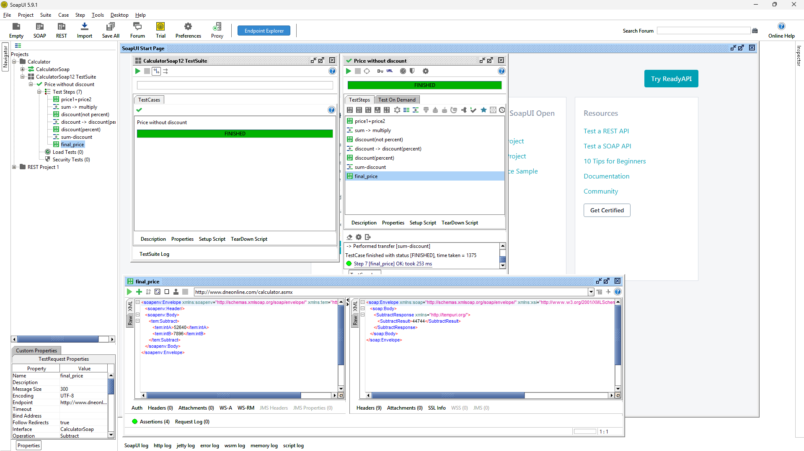
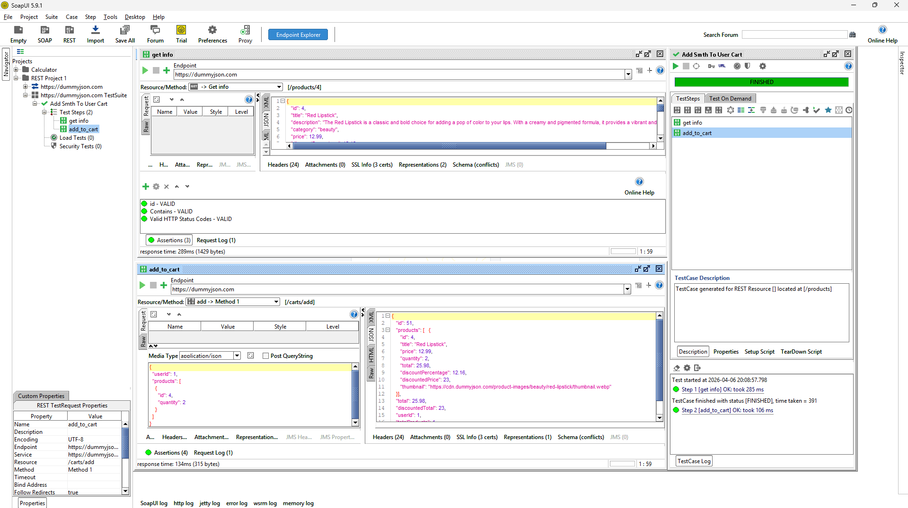

# Отчет

В SoapUI были выполнены задания по тестированию SOAP- и REST-сервисов.

Для SOAP был создан проект на основе публичного сервиса Calculator Service. В рамках задания реализован TestCase с бизнес-логикой расчёта итоговой стоимости с учётом скидки. В сценарии использовались последовательные вызовы операций сложения, умножения, деления и вычитания. Передача промежуточных значений между шагами была настроена с помощью Property Transfer. Для финального шага добавлена Assertion на проверку корректности результата. Тестовый сценарий выполнен успешно.

Для REST был создан проект с использованием публичного REST API. В рамках задания реализован сценарий получения информации о товаре и добавления товара в корзину пользователя. Были настроены запросы GET и POST, а также проверки ответов с помощью Assertions. Тестирование выполнено успешно, ответы сервиса соответствуют ожидаемым результатам.

Ниже приложены скриншоты выполненных проектов и результатов запуска тестов.

### SOAP:

### REST:

