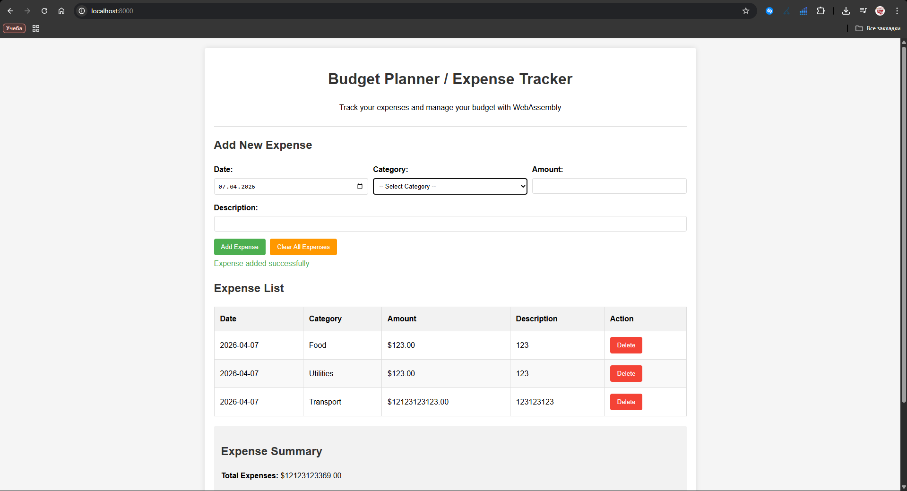

# Budget Planner / Expense Tracker WebAssembly Application

## Выполненные работы

Проект изучен, код проанализирован, и сделано улучшение: добавлена WebAssembly-логика для расчёта средней и максимальной суммы расхода.

- Проанализированы файлы `README.md`, `main.c`, `index.html`, `app.js`, `makefile`
- Определено, что проект компилируется через Emscripten и использует модуль `BudgetPlanner`
- Выявлено, что в текущей среде компилятора `emcc` нет, поэтому локальная сборка не выполнена здесь
- Подготовлена корректная инструкция по установке Emscripten и сборке проекта
- Реализовано улучшение: отображение средней и наибольшей суммы расходов в пользовательском интерфейсе
- Упрощена загрузка WebAssembly-модуля и исправлена часть HTML-структуры

## Структура проекта

- `main.c` — основная логика приложения на C, экспортируемая в WebAssembly
- `index.html` — интерфейс приложения и загрузка WebAssembly
- `app.js` — связь между WebAssembly и DOM, валидация формы и обновление отображения
- `makefile` — сборка проекта через Emscripten
- `index.js` / `index.wasm` — сгенерированные артефакты WebAssembly

## Улучшение (Improvement)

Добавлено новое сводное отображение расходов:

- Average Expense — средняя сумма добавленных расходов
- Highest Expense — самая крупная сумма среди добавленных расходов

Это улучшение реализовано на стороне C:
- добавлены функции `calculateAverageExpense()` и `calculateHighestExpense()`
- результат передаётся в JavaScript через `EM_ASM`

В интерфейсе отображение добавлено в раздел `Expense Summary`.

## Как компилировать

### 1. Установить Emscripten

Перейдите на страницу установки:

- https://emscripten.org/docs/getting_started/downloads.html

Для Windows используйте `emsdk` и активируйте окружение.

### 2. Сборка проекта

Откройте терминал в папке проекта и выполните:

```bash
make
```

Или вручную:

```bash
emcc main.c -o index.js -s WASM=1 -s ASSERTIONS=1 -s MODULARIZE=1 -s EXPORT_NAME='BudgetPlanner' \
  -s EXPORTED_FUNCTIONS='["_main","_showHelloMessage","_jsAddExpense","_jsDeleteExpense","_jsClearAllExpenses","_jsGetTotalExpenses","_jsGetExpenseCount","_jsGetCategoryCount","_getExpenseJSON","_getCategoryTotalJSON","_freeMemory","_malloc","_free"]' \
  -s EXPORTED_RUNTIME_METHODS='["ccall","cwrap","stringToUTF8","UTF8ToString"]' \
  -s ALLOW_MEMORY_GROWTH=1 main.c
```

### 3. Запуск

Запустите локальный сервер в каталоге проекта:

```bash
python3 -m http.server 8000
```

Откройте в браузере:

```text
http://localhost:8000/
```

## Проверка и тестирование

- Откройте страницу в браузере
- Добавьте несколько расходов
- Убедитесь, что таблица обновляется
- Проверьте, что значения `Total Expenses`, `Average Expense` и `Highest Expense` изменяются
- Убедитесь, что при удалении расхода данные пересчитываются корректно


