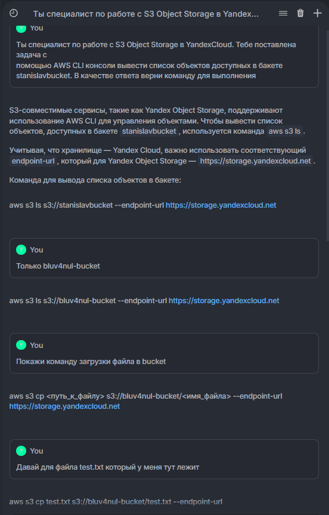
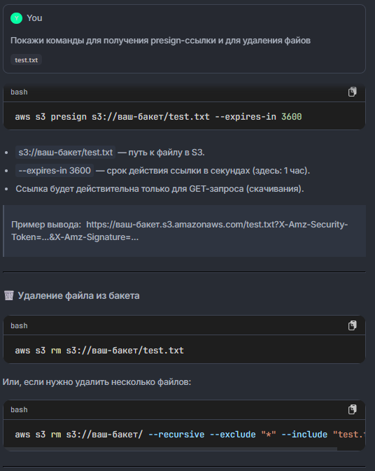

Ответы GigaCode:




---

# 📄 Краткий отчёт

Этот проект — простой веб-интерфейс на Node.js, позволяющий управлять файлами в S3-совместимом хранилище (например, Yandex Object Storage).

## ✅ Функционал

- Просмотр списка файлов в бакете
- Загрузка файлов
- Удаление файлов
- Получение временных presign-ссылок для просмотра (например, изображений)

## 🛠 Технологии

- Node.js + Express
- AWS SDK (v2)
- HTML/CSS/JS (без фреймворков)
- Multer — для загрузки файлов

## 🚀 Как запустить

1. Клонируйте репозиторий:

```bash
git clone https://github.com/ваш-ник/s3-file-manager.git
cd s3-file-manager
```

2. Установите зависимости:

```bash
npm install
```

3. Создайте .env на основе примера:

```bash
cp .env.example .env
```

4. Отредактируйте .env, указав свои ключи и имя бакета.

5. Запустите сервер:

```bash
node server.js
```

6. Откройте в браузере:

http://localhost:3000
