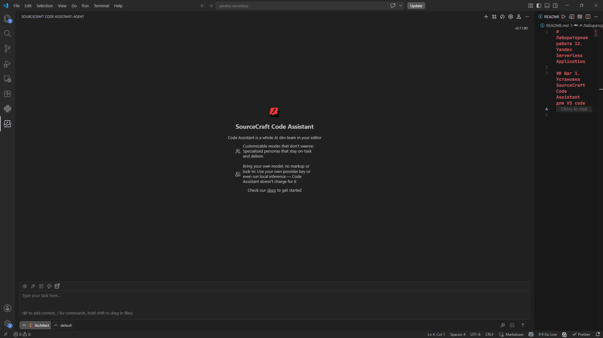
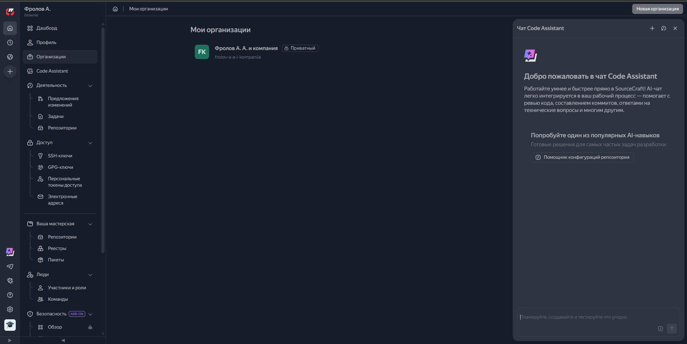
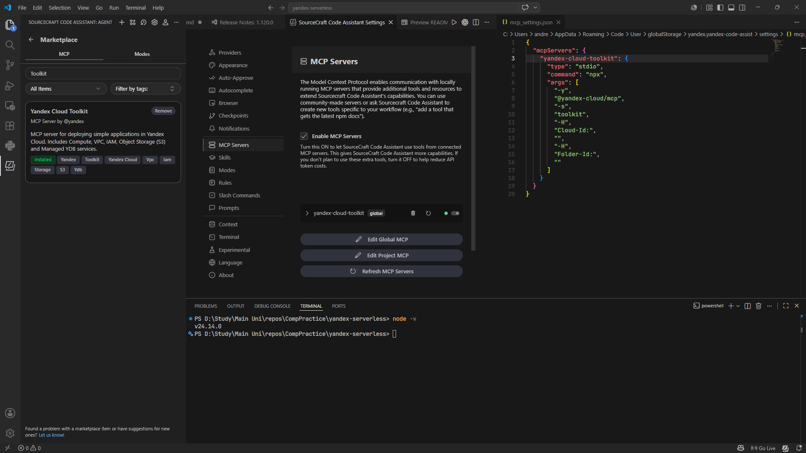
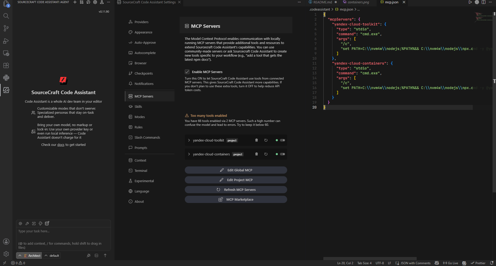

# Лабораторная работа 12. Yandex Serverless Applicatios

## Шаг 1. Установка SourceCraft Code Assistant для VS code

## Шаг 2. Установка MCP-плагин Yandex Cloud Toolkit а также Yandex Cloud Containers:

